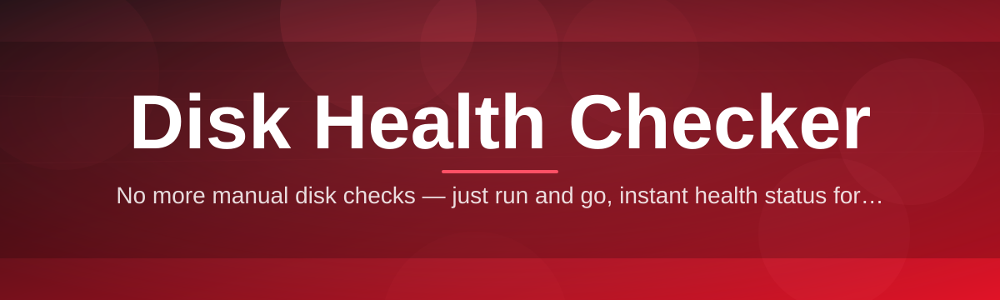
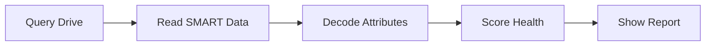

# disk-health-checker-analyzer 💽🩺

  

*A tiny, obsessive tool that reads the whispers your drive makes before it screams.*

  

## 🔍 Overview

I built **disk-health-checker-analyzer** because I was tired of finding out a drive was dying *after* it had already eaten a project folder. This is a lightweight Disk Health Checker and analyzer for Windows that reads S.M.A.R.T. attributes, surfaces early failure signals, and translates cryptic hexadecimal counters into plain language a human can actually act on. No cloud accounts, no telemetry, no subscription — just a focused disk health analyzer that respects your data and your time.

This project sits at the intersection of storage diagnostics and everyday peace of mind. Whether you're a sysadmin babysitting a rack of drives, a gamer wondering why load times crept up, or a hobbyist archiving family photos on an aging HDD, this tool gives you a clear read on drive temperature, reallocated sectors, pending sectors, power-on hours, and overall disk wear — all in one clean dashboard.

It started as a weekend itch-scratch and turned into something I genuinely care about maintaining. Every release is shaped by real disk failures — mine and yours. If you've ever stared at a spinning progress bar praying your SSD survives one more write cycle, this tool was made for you.

> [!NOTE]
> This is an independent, community-driven passion project. It is not affiliated with any drive manufacturer, and it never modifies your disk — it only reads diagnostic data.

  

---

## 🧠 What It Actually Does For You

| Capability | Why It Matters |
|---|---|
| **S.M.A.R.T. Deep Read** — pulls raw and normalized attribute values straight from the drive controller | Catches early warning signs like reallocated sectors long before Windows notices anything's wrong |
| **Temperature Trend Graphing** — plots thermal history across a session | Overheating is one of the quietest killers of both HDDs and SSDs |
| **Wear-Level Estimator** — for SSDs, estimates remaining write endurance | Tells you roughly how many "miles" are left on the odometer |
| **Bad Sector Scanner** — optional surface pass to flag unreadable blocks | Confirms whether physical damage exists beyond what SMART reports |
| **Plain-English Verdicts** — translates raw attribute IDs into human sentences | You shouldn't need a storage engineering degree to understand your own hardware |
| **Multi-Drive Dashboard** — checks every connected disk in one pass | Great for machines with multiple internal and external drives |
| **Exportable Health Reports** — save a snapshot as a local file | Useful for warranty claims or tracking degradation over months |
| **Zero-Install Portable Mode** — runs straight from a folder | Perfect for technicians carrying a diagnostics toolkit on a USB stick |

> [!TIP]
> Run a health check right after unboxing any new drive. A baseline reading makes it dramatically easier to spot abnormal drift later.

---

## 🚀 Getting Started

1. Visit the project landing page linked in the download button below.

2. Grab the latest build — it's a single portable executable, nothing to unpack or configure.

3. Launch it directly; Windows may show a SmartScreen prompt for new/unsigned indie tools — click "More info" → "Run anyway."

4. Select a drive from the list and hit **Scan** to get your first disk health report.

> [!IMPORTANT]
> Always keep backups of critical data regardless of what the health report says. A disk health checker predicts risk — it cannot guarantee failure timing.

---

## 🖥️ System Requirements

| OS | RAM | Disk Space |
|---|---|---|
| Windows 10 (64-bit) | 2 GB minimum | 50 MB free |
| Windows 11 (64-bit) | 4 GB recommended | 100 MB free |
| Windows Server 2019+ | 4 GB recommended | 100 MB free |

*Standalone build. No .NET runtime installs, no external dependencies, no background services.*

  

---

## ⚙️ How It Works

The analyzer talks directly to the drive's controller firmware through low-level ATA/NVMe pass-through commands, decodes the returned attribute table, then runs it through a scoring model tuned against thousands of real-world failure patterns.

1. **Query** — the tool enumerates connected physical drives on launch.
2. **Read** — raw attribute registers are pulled without altering any disk state.
3. **Decode** — vendor-specific and standard attributes are normalized into a common format.
4. **Score** — a weighted model flags risk tiers: Healthy, Watch, Warning, Critical.
5. **Report** — results render instantly in the dashboard, exportable on demand.

---

## 🧩 Troubleshooting

<strong>The app says "Access Denied" when scanning a drive.</strong>

Low-level SMART reads require elevated privileges. Right-click the executable and choose "Run as administrator."

<strong>My SSD shows no temperature data.</strong>

Some budget SSD controllers don't expose thermal sensors via standard NVMe logs. This is a firmware limitation, not a bug in the checker.

<strong>A drive shows "Unknown" health status.</strong>

Certain external USB enclosures strip SMART pass-through commands entirely. Try connecting the drive via a direct SATA or NVMe interface if possible.

<strong>Is a high "Power-On Hours" count automatically bad?</strong>

No. Power-on hours alone just tracks age. Combine it with reallocated sector counts and wear-level percentage for real risk assessment.

<strong>Can this tool fix or repair a failing disk?</strong>

No — it is strictly diagnostic. It reads and interprets, never writes or repairs sectors.

> [!WARNING]
> If the analyzer reports a "Critical" wear status, back up your data immediately, even if the drive still appears to work normally.

---

## 🎨 UI / UX Details

The interface leans minimal on purpose — a health-first dashboard shouldn't fight for attention.

| Shortcut | Action |
|---|---|
| `Ctrl + R` | Re-run scan on selected drive |
| `Ctrl + S` | Save health report to file |
| `Ctrl + D` | Toggle dark/light theme |
| `F1` | Open in-app quick reference |
| `Esc` | Cancel an active surface scan |

Themes ship in **Midnight**, **Slate**, and **Paper** variants, and the app remembers your last-used drive selection and window layout between sessions.

---

## 🤝 Contributing & Community

This project grows because people who've been burned by dying drives choose to give back. Bug reports, feature suggestions, translation help, and pull requests are all genuinely welcome.

> Open an issue describing the drive model, firmware version, and observed behavior — SMART attribute quirks vary wildly across vendors, and detailed reports make fixes possible.

- Found an attribute the analyzer misreads? File an issue.

- Have an idea for a new health metric? Start a discussion.

- Want to help translate the UI? Contributions are reviewed with care and credited.

---

## 📄 License

Released under the [MIT License](LICENSE), 2026. Use it, fork it, learn from it.

---

## ⚠️ Disclaimer

This Disk Health Checker is provided "as is" for informational and diagnostic purposes only. It estimates risk based on available SMART data but cannot predict every failure mode. Always maintain independent backups of important data — no software, including this one, can guarantee drive longevity.

  

